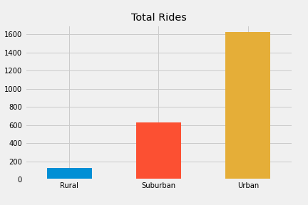
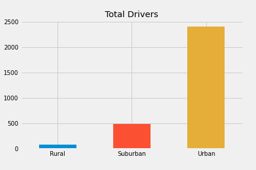
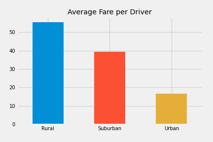

# PyBer Analysis 

## Overview 
PyBer's CEO would like to know how PyBer's ride-sharing service is performing across metrics Total Rides, Total Drivers, Total Fares, Average Fare per Ride, and Average Fare per Driver by city types (Urban, Suburban, and Rural).

## Results 
**Urban** city type substantially exceeds both **Suburban** and **Rural** cities in Total Rides, Total Drivers, and Total Fares. **Rural** city type exceeds **Urban** and **Suburban** city types with Average Fare per Ride and Average Fare per Driver. 

 

## Summary 
Recommendations to address disparities amon the different city types.
- Let Urban and Suburban drivers aware of opportunities for higher fares per ride and higher fares per driver are in the Rural cities
- Urban drivers expanding to Suburban cities 
- Drivers should go to where demand is the highest, in Rural cities
