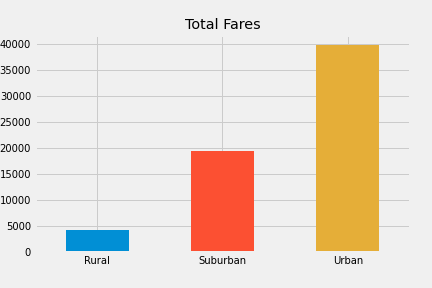

# PyBer Analysis 

## Overview 
Explain the purpose of the new analysis.

## Results 
Using images from the summary DataFrame and multiple-line chart, describe the differences in ride-sharing data among the different city types. There is a description of the differences in ride-sharing data among the different city types. Ride-sharing data include the 

 

## Summary 
Based on the results, provide three business recommendations to the CEO for addressing any disparities among the city types. There is a statement summarizing three business recommendations to the CEO for addressing any disparities among the city types.
